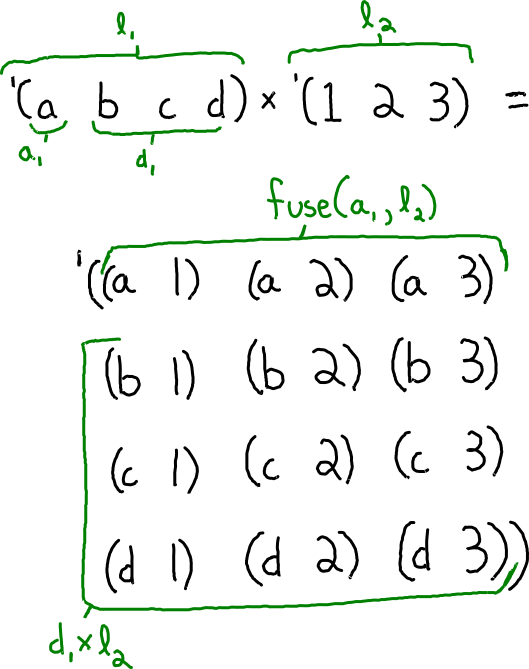

# Cartesian Product

The Cartesian product is typically defined in terms of sets, but I will use lists since they are easier to work with in miniKanren. So the Cartesian product is a relation between three lists: `l₁`, `l₂`, and `l₁×l₂`.

The base case is straightforward. When l₁ is empty, then the product is empty. It is like multiplying by zero.

The recursive case is more interesting. I always like to start by drawing a picture and annotating things that should be named in green. This helps me figure out the relationships.



From this picture I can see that `l₁` is nonempty, meaning it has a head `a₁` and a tail `d₁`. That gives an opportunity for recurring on `d₁×l₂`. Finally, to get the entirety of `l₁×l₂` I need to somehow "fuse" `a₁` onto each element of `l₂` and append it to `d₁×l₂`.

```scheme
(defrel (cartesian-producto/v1 l₁ l₂ l₁×l₂)
  (conde ((== l₁ '()) (== l₁×l₂ '()))
         ((fresh (a₁ d₁ d₁×l₂ fusion)
            (== l₁ `(,a₁ . ,d₁))
            (fuseo a₁ l₂ fusion)
            (appendo fusion d₁×l₂ l₁×l₂)
            (cartesian-producto/v1 d₁ l₂ d₁×l₂)))))
```

Using the canonical `appendo`, and an interesting helper, `fuseo`.

```scheme
(defrel (fuseo sym l o)
  (conde ((== l '()) (== o '()))
         ((fresh (a d rec)
            (== l `(,a . ,d))
            (== o `((,sym ,a) . ,rec))
            (fuseo sym d rec)))))
```

Let’s see if `cartesian-producto/v1` can be run forwards. This output has been hand-formatted for easier reading.

```
> (run* (q) (cartesian-producto/v1 '(a b c d) '(1 2 3) q))
'((((a 1) (a 2) (a 3)
    (b 1) (b 2) (b 3)
    (c 1) (c 2) (c 3)
    (d 1) (d 2) (d 3))))
```

It works! Can it also run backwards?

```
> (run 1 (x y)
    (cartesian-producto/v1 x y
      '((a 1) (a 2) (a 3)
        (b 1) (b 2) (b 3)
        (c 1) (c 2) (c 3)
        (d 1) (d 2) (d 3))))
'(((a b c d) (1 2 3)))
```

Here’s an example of a Cartesian product that can be written 2 different ways. Let’s see if miniKanren can find both.

```
> (run 2 (x y)
    (cartesian-producto/v1 x y '((a 1) (a 2) (a 1) (a 2))))
'(((a a) (1 2))
  ((a)   (1 2 1 2)))
```

For all my queries so far, I know that an answer exists and I’m asking miniKanren to find it. Let’s see if it can handle queries where there is no correct answer:

```
> (run 1 (q) (cartesian-producto/v1 '(a b c) '(1 2 3) '()))
'()
```

It correctly identified that that the cross product of `'(a b c)` and `'(d e f)` cannot be the empty list. Here is a trickier test: is `'((a 1) (b 2))` the cross product of two lists? Never. Let’s see if miniKanren can figure that out.

```
> (run 1 (x y) (cartesian-producto/v1 x y '((a 1) (b 2))))
...
```

The query diverges! It should produce `'()` like before, but it loops forever instead. Let’s analyze why.

This query provides a ground version of `l₁×l₂`, but it leaves `l₁` and `l₂` fresh. Since we know that `l₁×l₂` is nonempty, the first conde clause fails, and so `l₁` must be nonempty too. But `l₂` could still be empty, in which case fusion is empty, and so appendo immediately halts with `d₁×l₂` being unified to `l₁×l₂`. Then it recurs on d₁, which is fresh since l₁ was fresh, `'()`, and `d₁×l₂`, which is really just l₁×l₂. It is a recursive call where nothing has changed, except that l₂ is ground as the empty list (but that was picked on purpose), so it would continue to call itself infinitely.

# First refactor

One way to fix the divergence to separate `l₂` into its empty and nonempty cases. This ends up being pretty straightforward: the output is empty when `l₂` is empty and so does not require recursion. And now `l₂` needs to be nonempty in the recursive clause.

```scheme
(defrel (cartesian-producto/v2 l₁ l₂ l₁×l₂)
  (conde ((== l₁ '()) (== l₁×l₂ '()))
         ((== l₂ '()) (== l₁×l₂ '()))
         ((fresh (a₁ d₁ a₂ d₂ d₁×l₂ fusion)
            (== l₁ `(,a₁ . ,d₁))
            (== l₂ `(,a₂ . ,d₂))
            (fuseo a₁ l₂ fusion)
            (appendo fusion d₁×l₂ l₁×l₂)
            (cartesian-producto/v2 d₁ l₂ d₁×l₂)))))
```

Let’s see if that fixes the divergent query:

```
> (run 1 (x y) (cartesian-producto x y '((a 1) (b 2))))
...
```

It still diverges! But I’m not surprised. `cartesian-producto/v1` and `v2` are recursive relations which both uses two other recursive relations: `fuseo` and `appendo`.

## Second Refactor
Another refactor I can try is to both fuse and append at the same time, e.g.:

```
> (run 1 (q)
    (fuse-and-appendo
      'x
      '(a b c)
      '((y d) (y e) (y f)) q))
'(((x a) (x b) (x c)
   (y d) (y e) (y f)))
```
That way, cartesian-producto would not need the intermediate variable fusion.

```scheme
(defrel (cartesian-producto l₁ l₂ l₁×l₂)
  (conde ((== l₁ '()) (== l₁×l₂ '()))
         ((== l₂ '()) (== l₁×l₂ '()))
         ((fresh (a₁ d₁ a₂ d₂ d₁×l₂ fusion)
            (== l₁ `(,a₁ . ,d₁))
            (== l₂ `(,a₂ . ,d₂))
            (fuse-and-appendo a₁ l₂ d₁×l₂ l₁×l₂)
            (cartesian-producto d₁ l₂ d₁×l₂)))))
```

Here is the implementation of fuse-and-appendo:

```scheme
(defrel (fuse-and-appendo sym l r o)
  (conde ((== l '()) (== r o))
         ((fresh (a d rec)
                 (== l `(,a . ,d))
                 (== o `((,sym ,a) . ,rec))
                 (fuse-and-appendo sym d r rec)))))
```

It’s not always possible to define conjunction of two recursive relations as a singly-recursive relation, so it’s great when it works. The basis for this correctness-preserving transformation is a logical rule of inference shown here:

​```math
\frac
    {((p \land a) \lor (\neg p \land b)) \land ((p \land x) \lor (\neg p \land y))}
    {(p \land a \land x) \lor (\neg p \land b \land y)}
```

TODO: get a better understanding of this divergence by using the first-order-miniKanren debugger defined in: [http://minikanren.org/workshop/2019/minikanren19-final2.pdf]().

I don’t have a solid explanation for why this transformation is necessary, other than that it uses fewer recursive relations, which can sometimes prevent divergence.
Nevertheless, let’s see if this change helps:

```
> (run 1 (x y) (cartesian-producto x y '((a 1) (b 2))))
'()
```

That did the trick! But notice that fuse-and-appendo allows l₂ to be empty, so both refactors are needed together to prevent divergence.