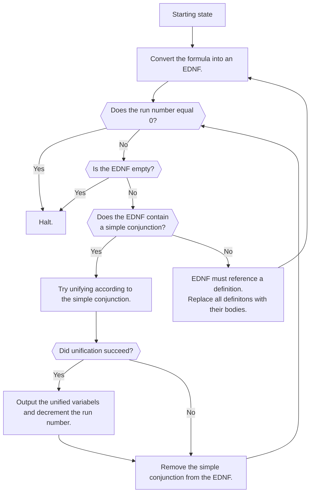

# `defrel` and `run`

miniKanren expressions in existential disjunctive normal form (EDNFs) become especially useful when they have one ore more **simple conjunctions**. A simple conjunction is when one of the inner conjunctions of the EDNF contains only the equality relation `==`.

Consider the following `run` clause:
```scheme
(run 10 (q)
    (fresh (a b c)
        (conde
            ((== a 'x) (== b 'y) (== c 'z))
            ((po a) (qo b) (ro c))
            ((== a 0) (== a 1))
            ((so a b c)))))
```

The first and third conjunctions are simple conjunctions. There is a straightforward unification algorithm when every clause in a conjunction is `==`. Applying this algorithm on the first algorithm succeeds with result `'(x y z)`, which can be added to the output.

Then the `run` expression can remove that simple conjunction and decrement its run number.
```scheme
(run 9 (q)
    (fresh (a b c)
        (conde
            ((po a) (qo b) (ro c))
            ((== a 0) (== a 1))
            ((so a b c)))))
```

The second simple conjunction fails because `a` cannot be both 0 and 1. It can be removed but no result is added to the output and the run number stays 9.

```scheme
(run 9 (q)
    (fresh (a b c)
        (conde
            ((po a) (qo b) (ro c))
            ((so a b c)))))
```

Since there are no more simple conjunctions, the next step is to apply the non-`==` relations to their arguments, that is, replace those relations with their definitions.


Here is the algorithm in full:

