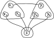

# A rule of inference
Brett Schreiber, 2023-01-02. Edited 2024-01-21.

Here is a rule of inference that I found:

$$
\frac
  {(b \lor p) \land (\neg p \lor \neg q) \land (q \lor d)}
  {b \lor d}
$$

Here is a derivation:

$$
\frac
  {(b_1 \lor b_2 \lor p_1 \lor p_2) \land ((\neg p_1 \land \neg p_2) \lor (\neg q_1 \land \neg q_2 \land \neg q_3)) \land (q_1 \lor q_2 \lor q_3 \lor d_1)}
  {b_1 \lor b_2 \lor d_1}
$$

The most general form I could find is this:

$$
\frac
  {((\bigvee_i b_i) \lor (\bigvee_i p_i)) \land ((\bigwedge_i \neg p_i) \lor (\bigwedge_i \neg q_i)) \land ((\bigvee_i q_i) \lor (\bigvee_i d_i))}
  {(\bigvee_i b_i) \lor (\bigvee_i d_i)}
$$

This is similar to [resolution](https://en.wikipedia.org/wiki/Resolution_(logic)), except the premise in this rule of inference is not in [conjunctive normal form](https://en.wikipedia.org/wiki/Conjunctive_normal_form) (CNF). To convert it to CNF requires expanding the term $(\bigwedge_i \neg p_i) \lor (\bigwedge_i \neg q_i)$ into $\bigwedge_{(i, j)} (\neg p_i \lor \neg q_j)$. The resulting CNF is quadratically larger. I think it is harder to convert in the other direction.

## A graph-hypergraph data structure

One way I've tried to apply this rule of inference to a CNF is to draw a picture.

For example, I would draw the following CNF:

$$
(x_1 \lor x_2 \lor x_3) \land \\
(y_1 \lor y_2 \lor y_3) \land \\
(z) \land \\
(\neg x_1 \lor \neg y_1) \land \\
(\neg x_2 \lor \neg z) \land \\
(\neg x_3 \lor \neg z) \land \\
(\neg y_2 \lor \neg z) \land \\
(\neg y_3 \lor \neg z)
$$

Like this:

