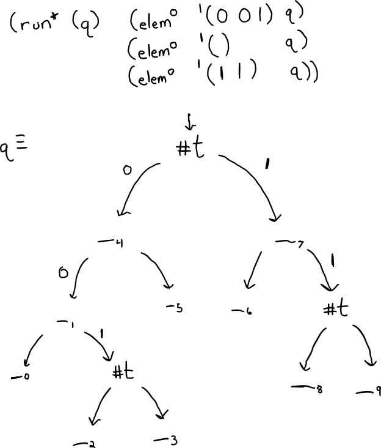

# Set of Binary Natural Numbers

Here's an idea on how to represent sets of natural numbers in miniKanren.

I want to start with the simplest thing I can think of: testing a subset of the naturals for membership. I'm still thinking about how to implement testing for non-membership.

If you were to ask me which subset of the naturals contains 4, and 0, and 3, I'd say {0 ... 3, 4, ... }.



```scheme
(defrel (elemo n s)
  (fresh (l m r)
    (== s `(,l ,m ,r))
    (conde ((== n '()) (== m #t))
           ((fresh (a d rec)
              (== n `(,a . ,d))
              (conde ((== a 0) (>0o d) (== rec l))
                     ((== a 1) (== rec r)))
              (elemo d rec))))))
```

```
> (run* (q) (elemo '(0 0 1) q)
            (elemo '() q)
            (elemo '(1 1) q))
'((((_.0 _.1 (_.2 #t _.3)) _.4 _.5) #t (_.6 _.7 (_.8 #t _.9))))
``` 

Raffi Sanna helped me figure out the code for its complement;

```scheme
;; Adapted from code by Raffi Sanna
(defrel (!elemo n s)
  (fresh (l r)
    (conde ((== s '()))
           ((== n '()) (== s `(,l #f ,r)))
           ((fresh (val b rec)
              (== s `(,val ,l ,r))
              (conde ((== n `(0 . ,b)) (>0o b) (== rec l))
                     ((== n `(1 . ,b)) (== rec r)))
              (!elemo b rec))))))
```
